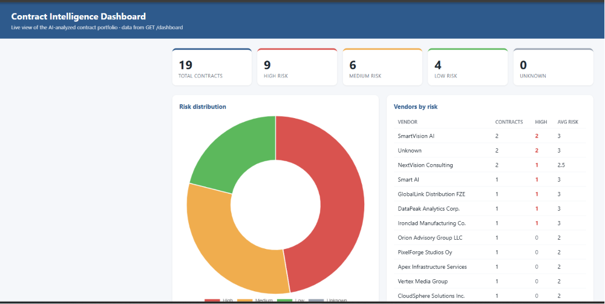

# Enterprise AI Contract Intelligence Platform

[](https://github.com/arnienemeth/enterprise-ai-contract-intelligence/actions/workflows/deploy.yml)

**Author:** Arnold Nemeth
**Version:** MVP v1.0
**Status:** Working end-to-end MVP demonstrating an enterprise-grade AI architecture. The AI core (ingest → analyze → store → search → dashboard) runs locally against Azure OpenAI; the enterprise integration layer (SharePoint / Power Automate) is designed and documented.

**🔗 Live demo:** [dashboard](https://contract-ai-api.calmfield-8431240b.westeurope.azurecontainerapps.io/dashboard-view) · [API docs (Swagger)](https://contract-ai-api.calmfield-8431240b.westeurope.azurecontainerapps.io/docs)
*(Deployed on Azure Container Apps. First load may take a few seconds while the container wakes.)*



An **Enterprise AI Contract Intelligence Platform** built with Azure OpenAI, FastAPI and a
vector database. It ingests contracts, runs LLM-based risk analysis, generates executive
summaries, answers natural-language questions over the contract knowledge base using
Retrieval-Augmented Generation (RAG), and visualizes portfolio risk on a live dashboard.

The design deliberately mirrors the shape of enterprise AI solutions delivered by firms such
as IBM, Microsoft, Deloitte and Accenture.

---

## Key Features

- **AI risk analysis** — every contract is scored (0–100), classified Low/Medium/High, and
  summarized, with financial, compliance, GDPR, liability and operational risk called out.
- **Semantic search + RAG** — ask natural-language questions ("which vendors have GDPR
  issues?") and get answers grounded in your own contracts, with sources cited.
- **Vector store** — Azure OpenAI embeddings in a persistent ChromaDB collection, cosine
  similarity search.
- **Live dashboard** — an HTML page with KPI cards, a risk-distribution chart, and a
  vendors-by-risk table, all served from the API.
- **Vendor analytics** — vendors ranked by a weighted risk score (High×3, Medium×2, Low×1).
- **Structured JSON output** — the AI returns strict JSON so downstream systems (dashboards,
  SharePoint, Power Automate) can consume it directly.

---

## Architecture

```text
                        SharePoint
                  Contracts Repository            [designed]
                          |
                          v
                  Power Automate Flow             [designed]
                          |
                          v
                   FastAPI REST API               [implemented]
                          |
         +----------------+----------------+
         v                                 v
   Azure OpenAI (chat)          Azure OpenAI (embeddings)   [implemented]
   risk / RAG answers           vectorization
         |                                 |
         +----------------+----------------+
                          v
                  ChromaDB Vector Store           [implemented]
                          |
                          v
                   Semantic Search                [implemented]
                          |
                          v
        Enterprise AI Answers / Risk JSON         [implemented]
                          |
                          v
                  Live Risk Dashboard             [implemented]
```

See [ARCHITECTURE.md](ARCHITECTURE.md) for the full component breakdown.

---

## Technology Stack

| Layer | Technology |
|-------|------------|
| Backend / API | Python 3.10+, FastAPI, Uvicorn |
| AI | Azure OpenAI — chat (`gpt-4o-mini`) + embeddings |
| Vector store | ChromaDB (persistent, cosine similarity) |
| Pattern | Retrieval-Augmented Generation (RAG) |
| Interface | REST API + Swagger UI + HTML dashboard |

---

## Project Structure

```text
enterprise-ai-mcp-project/
|
├── api/
│   └── main.py                 # FastAPI app: all REST endpoints + dashboard
├── vector_store/
│   └── embedding_engine.py     # ChromaDB + Azure embeddings (add / search / stats)
├── vector_db/                  # ChromaDB persistent store (chroma.sqlite3)
├── documents/                  # Sample contracts (.txt)
├── mcp_server/
│   └── server.py               # Prototype MCP server (future integration, not in prod)
|
├── reindex.py                  # Re-embed documents/ with real AI-derived metadata
├── requirements.txt
├── .env.example                # Config template (no secrets)
├── .gitignore
├── README.md
├── PROJECT_STATUS.md           # Verified-vs-planned status
├── ARCHITECTURE.md
├── ROADMAP.md
├── CHANGELOG.md
└── TESTING.md                  # Step-by-step testing guide
```

---

## Quick Start

```bash
# 1. Create and activate a virtual environment
python -m venv venv
venv\Scripts\activate          # Windows
# source venv/bin/activate     # macOS / Linux

# 2. Install dependencies
pip install -r requirements.txt

# 3. Configure Azure OpenAI
copy .env.example .env         # then fill in your values
# (macOS/Linux: cp .env.example .env)

# 4. Run the API from the project root
uvicorn api.main:app --reload

# 5. Explore
#    Swagger UI:      http://127.0.0.1:8000/docs
#    Live dashboard:  http://127.0.0.1:8000/dashboard-view
```

Run `uvicorn` **from the project root** — the ChromaDB path is resolved relative to the
working directory (`./vector_db`).

---

## API Endpoints

| Method | Path | Purpose | Needs Azure |
|--------|------|---------|:-----------:|
| GET | `/` | Health check | No |
| POST | `/health-test` | Status probe | No |
| GET | `/dashboard` | Contract counts by risk level + vendor (JSON) | No |
| GET | `/dashboard-view` | Visual HTML dashboard (cards, chart, table) | No |
| GET | `/vendor-analytics` | Vendors ranked by weighted risk score | No |
| POST | `/upload-contract` | Embed a contract + return structured risk JSON | Yes |
| POST | `/ask` | RAG: semantic search → LLM answer | Yes |
| POST | `/semantic-search` | Return most similar contracts | Yes |
| POST | `/find-risky-contracts` | Filter results for risk/GDPR/liability keywords | Yes |

Full request/response details are in the comprehensive documentation
(`Enterprise_AI_Contract_Intelligence_Documentation.docx`).

---

## Loading Sample Data

The `documents/` folder ships with sample contracts spanning Low, Medium and High risk across
many vendors. To embed them with correct AI-derived metadata:

```bash
python reindex.py --reset
```

Then open the dashboard at `http://127.0.0.1:8000/dashboard-view`.

---

## Environment Variables

See [.env.example](.env.example). Required:

```text
AZURE_OPENAI_API_KEY=
AZURE_OPENAI_ENDPOINT=
AZURE_OPENAI_API_VERSION=
AZURE_OPENAI_DEPLOYMENT=
AZURE_OPENAI_EMBEDDING_DEPLOYMENT=
```

---

## Security

**Never commit `.env`.** It contains a live Azure OpenAI API key. If a key is ever exposed,
rotate it immediately in the Azure Portal. The shipped `.gitignore` excludes `.env`, `venv/`,
and the vector store.

---

## Documentation

- [PROJECT_STATUS.md](PROJECT_STATUS.md) — verified-vs-planned status and known issues
- [ARCHITECTURE.md](ARCHITECTURE.md) — system architecture and component design
- [ROADMAP.md](ROADMAP.md) — phased roadmap to a production-ready platform
- [TESTING.md](TESTING.md) — step-by-step testing guide
- [CHANGELOG.md](CHANGELOG.md) — version history
- `Enterprise_AI_Contract_Intelligence_Documentation.docx` — full technical documentation (also as PDF)

---

## License

Personal / portfolio project.
